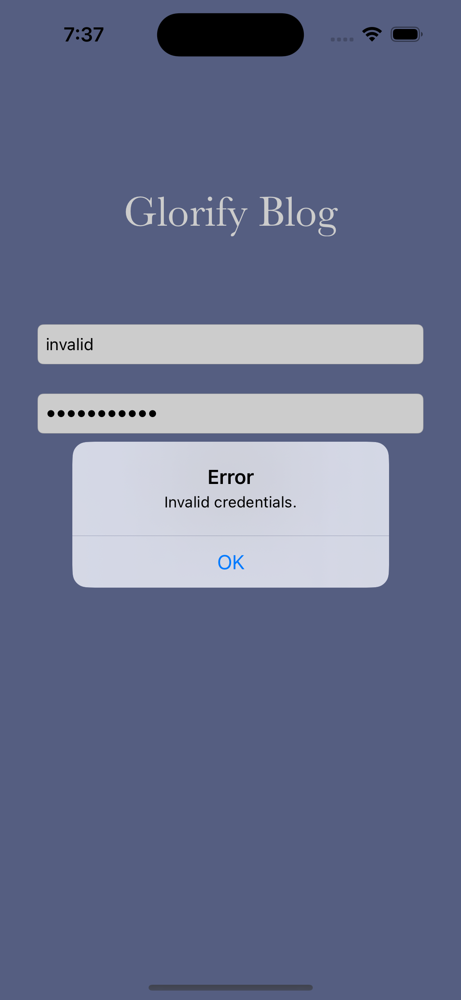
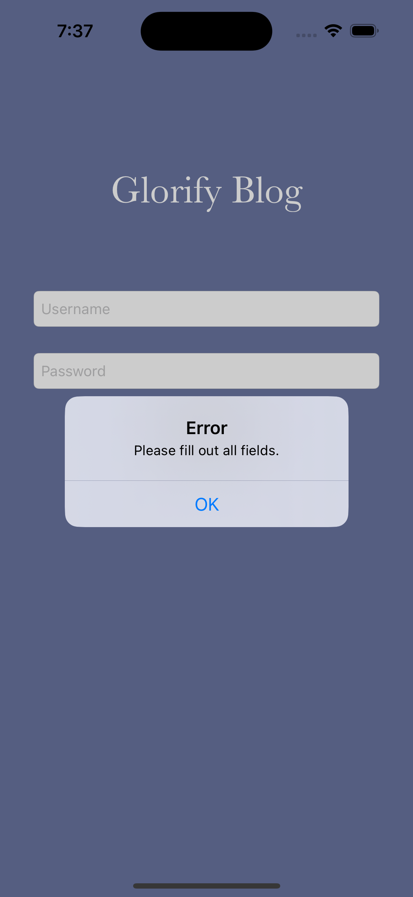
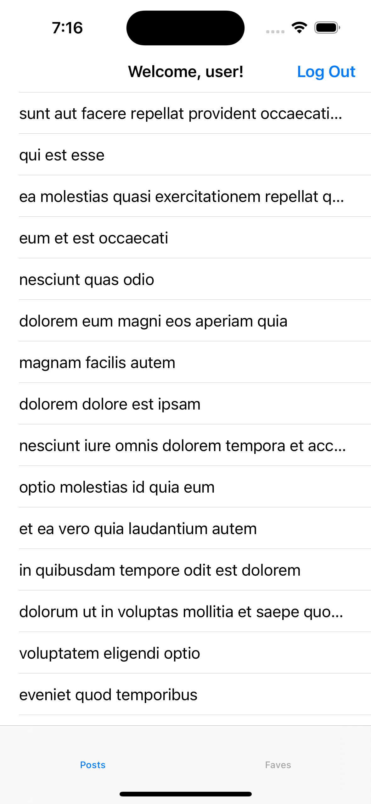
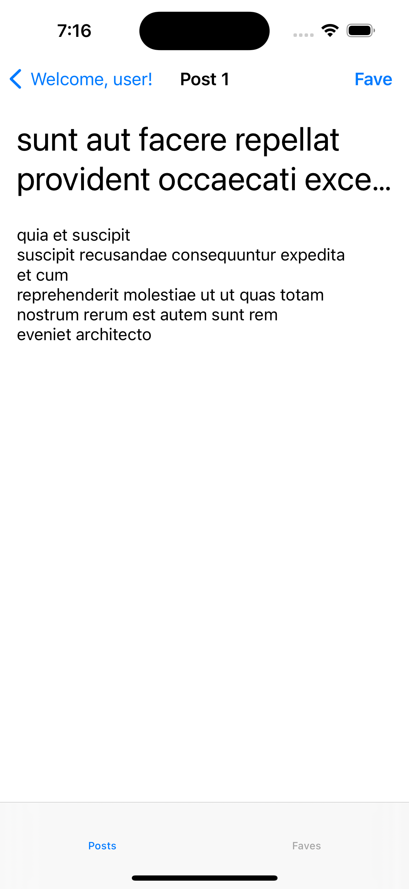
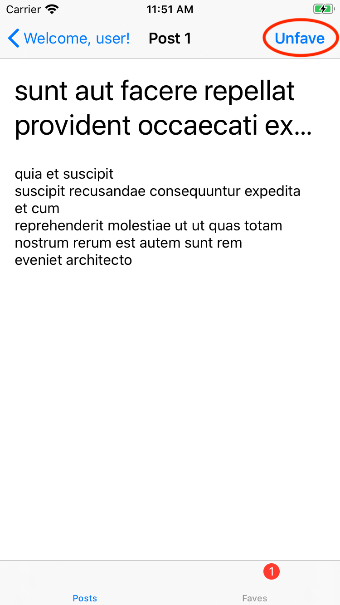
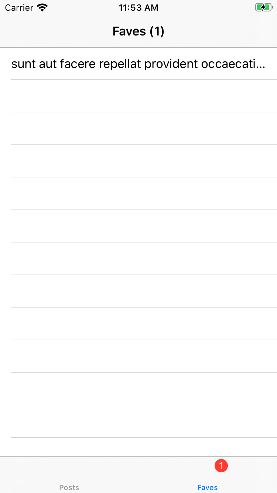
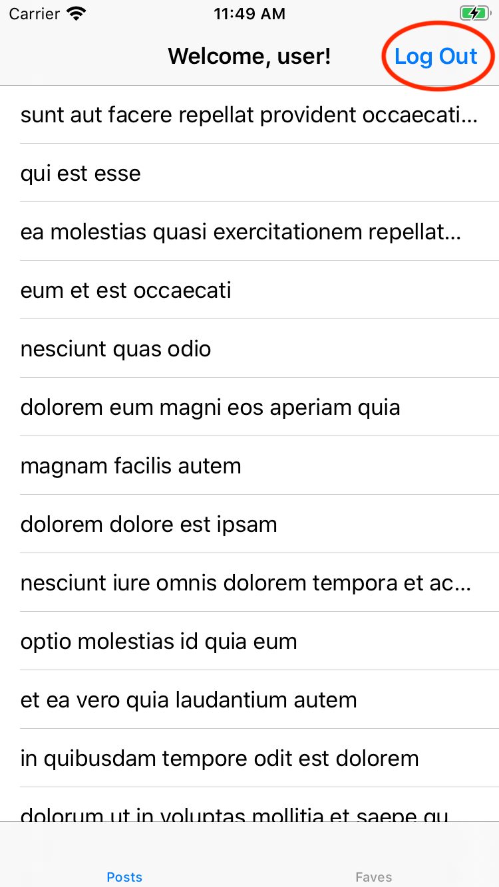

# App Walkthrough

The prototype has the following features

## 💡 Log In 💡

Upon launching the app, users are required to log in

Entering invalid credentials notifies the user

Entering no credentials notifies the user

## 💡 Post List 💡

Upon logging in, the user views a list of all Blog Posts

## 💡 Post Detail 💡

Upon selecting a Post from the list, user can view Post Details

User can add a post to Faves by tapping the **Fave** button. A favorited post can be removed from Faves by tapping the same button, now reading **Unfave**.

## 💡 Favorites 💡

Upon selecting the Faves tab, user can view any Posts that were Favorited from the Post List

## 💡 Log Out 💡

User is able to log out by tapping **Log Out** button on Post List

